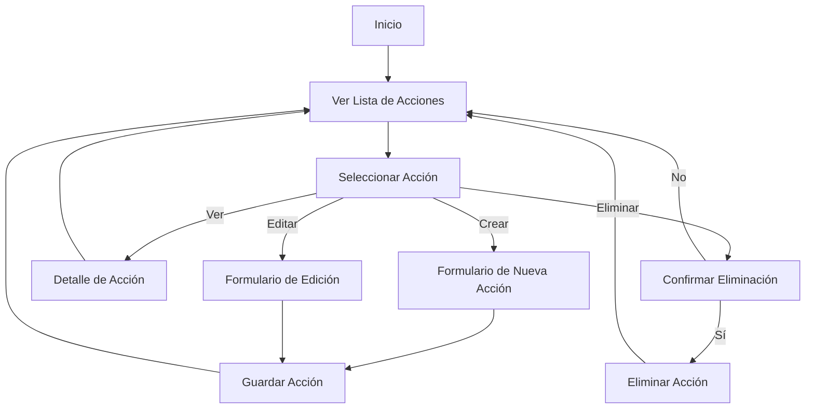

### Diagrama de Flujo

El diagrama de flujo se centra en el proceso CRUD (Crear, Leer, Actualizar, Eliminar) para el registro de acciones.

Este diagrama representa las opciones de navegación y las acciones que un usuario puede realizar en la aplicación web para manejar el registro de acciones.
